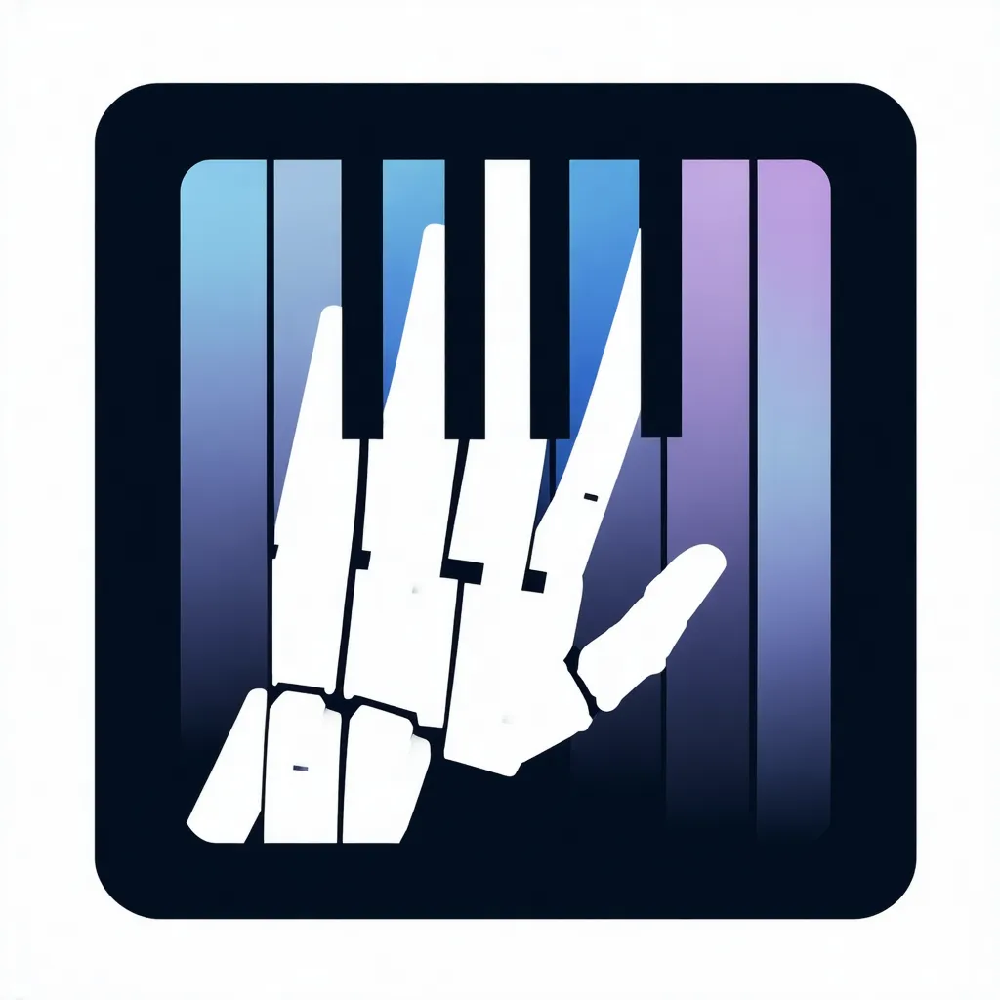

<div align="center">
  

  <h1>PANDORA</h1>
  <h3>Diffusion Policy Learning for Dexterous Robotic Piano Playing</h3>

  <p>
    <a href="https://taco-group.github.io/PANDORA/" target="_blank">
      
    </a>
    <a href="https://github.com/taco-group/PANDORA" target="_blank">
      
    </a>
    <a href="https://arxiv.org/abs/2503.14545" target="_blank">
      
    </a>
    <a href="https://opensource.org/licenses/MIT" target="_blank">
      
    </a>
  </p>
</div>

---

## 🧠 Abstract

**PANDORA** is a novel diffusion-based policy learning framework for **dexterous robotic piano performance**.  
It leverages a **conditional U-Net with FiLM conditioning** to iteratively denoise noisy action sequences into smooth, high-dimensional trajectories.

To enhance expressiveness and musical fidelity, we introduce a **composite reward function** that integrates task-specific objectives with high-level feedback from a **Large Language Model (LLM)** oracle.  
This oracle assesses performance **style** and **semantic correctness**, enabling dynamic, hand-specific reward adjustment.

Combined with **residual inverse-kinematics refinement**, PANDORA achieves **state-of-the-art performance** in the ROBOPIANIST environment, significantly outperforming baseline methods.

---

## 🎹 Pipeline Overview

<div align="center">
  
</div>

<p align="center">
  <i>Overview of PANDORA’s diffusion-based action generation pipeline and LLM-driven reward evaluation.</i>
</p>

---

## 📖 Citation

If you find this work useful, please consider citing us:

```bibtex
@misc{huang2025pandoradiffusionpolicylearning,
      title={PANDORA: Diffusion Policy Learning for Dexterous Robotic Piano Playing}, 
      author={Yanjia Huang and Renjie Li and Zhengzhong Tu},
      year={2025},
      eprint={2503.14545},
      archivePrefix={arXiv},
      primaryClass={cs.LG},
      url={https://arxiv.org/abs/2503.14545}, 
}